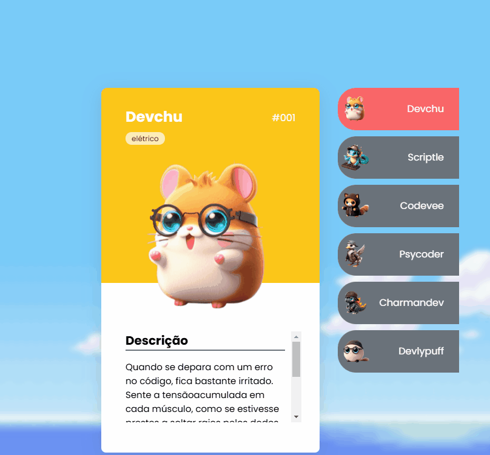

# Projeto Pokedevs

## Um projeto criado ao participar de um workshop. 

### O projeto é baseado em criar uma "Pokédex" do jogo Pokémon, mas ao invés de exibir os Pokémons e suas descrições, é mostrado uma versão de desenvolvedor dos mesmos, como no caso do Pikachu que se torna o Devchu.

[]

## Tecnologias utilizadas

- HTML
- CSS
- JS
## Como utilizar

1 - Clone para o projeto

```
git clone https://github.com/LucasERMachado/Projeto-Pokedevs.git
```

2 - Acesse a pasta do projeto

```
cd repositorio-com-readme
```

3 - Para abrir

```
code .
```
Como o projeto é bem simples, basta clicar no nome do Pokédev desejado ao lado e o mesmo será exibido na tela.

